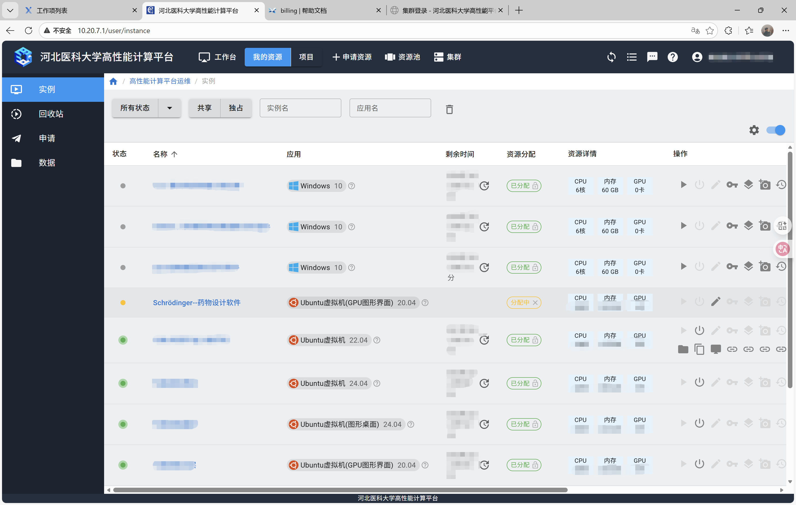
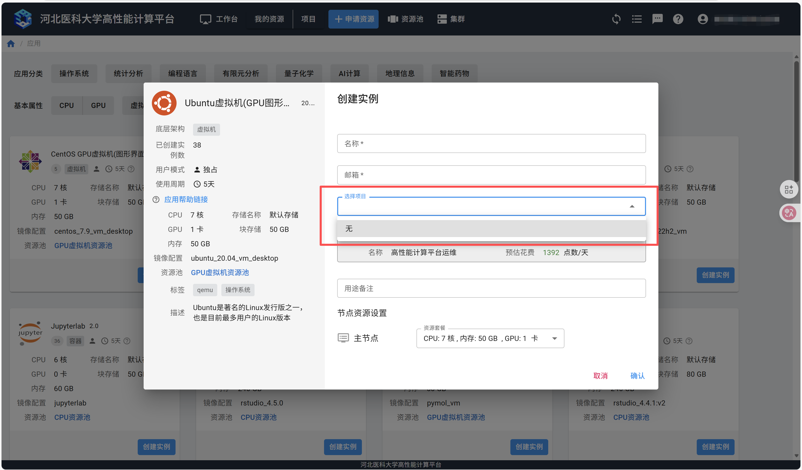
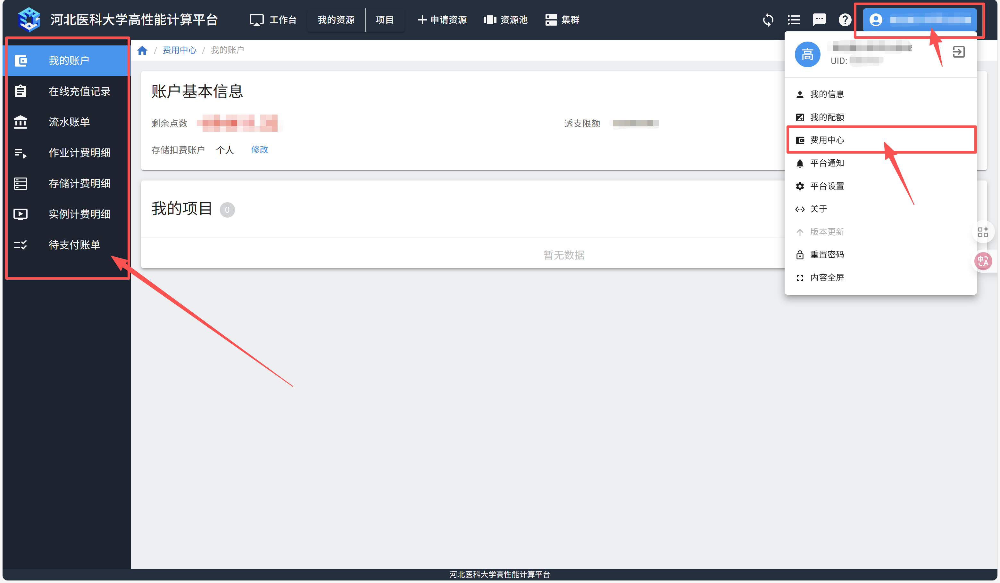
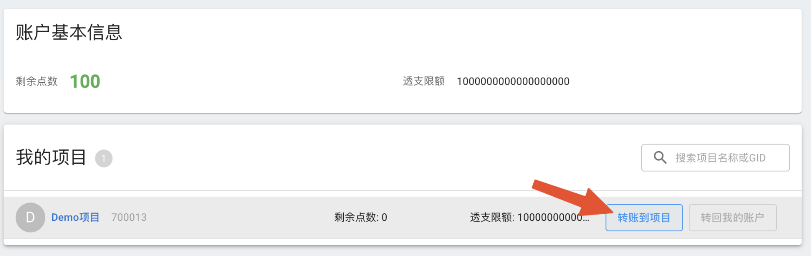
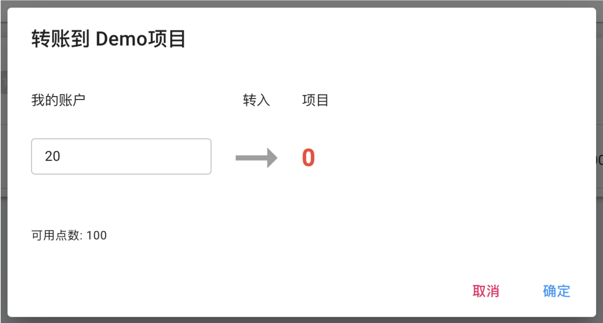
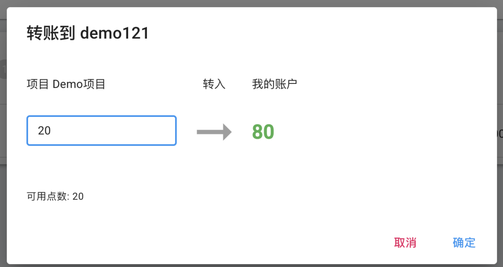
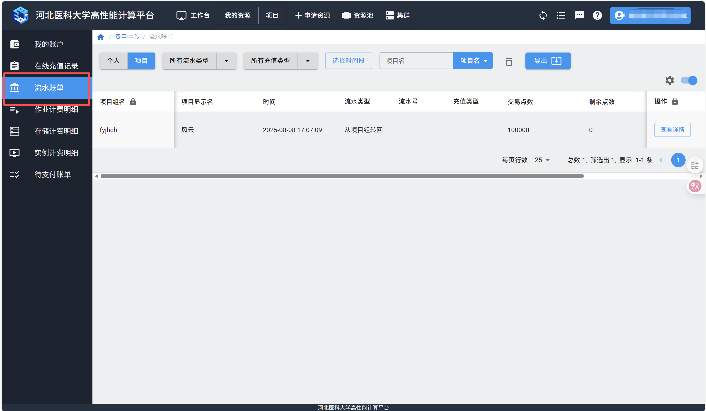
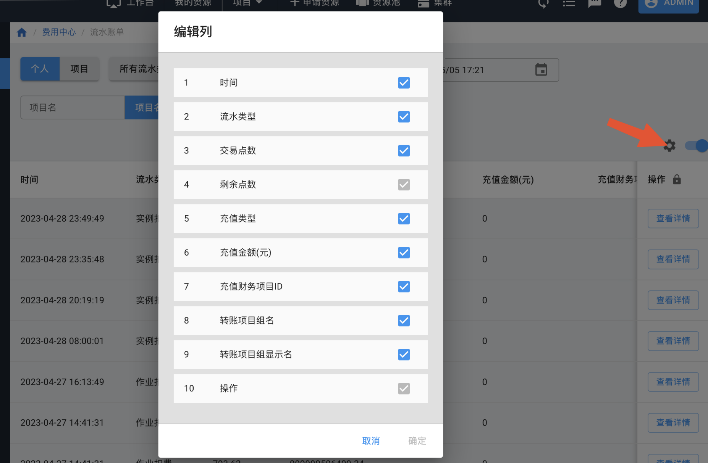
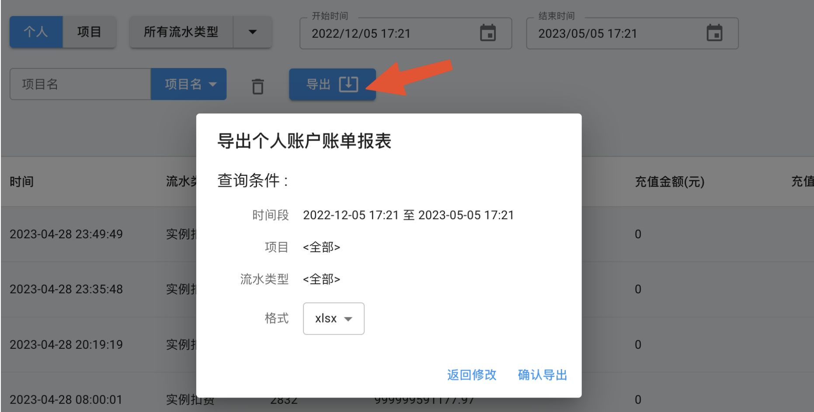

===========
计费统计    
===========

:wb:`计费统计`
================

.. raw:: html 

    

本页将介绍系统的计费功能，包括计费方法、查看个人账户、指定计费账户、转帐到项目组账户等。

:black:`计费方法`
=================

.. raw:: html

    

系统的扣费账户分为两类，一类是个人账户，一类是共享项目账户。用户在提交实例或作业时，可以指定是从个人账户扣款还是从共享项目账户扣款。

系统采用 :cmd:`点数` 计算资源费用。个人账户的点数需要管理员充值，点数=充值金额*充值汇率。项目帐户的点数由项目管理员从个人账户内转账至项目账户。

用户的实例或作业完成后，系统根据资源使用类型、时长和计费权值计算费用。

计费公式：∑(r * t * w)

r是资源数量，比如 CPU 核数，GPU 卡数。

t是资源运行时长。具体运行时长的计算方式参见下文。

w是计费权值。计费权值是调节不同资源价格的参数，可以将不同类型的资源消耗，折算成统一的计费点数。

作业运行时长：用户在集群中通过提交作业的形式来进行批量计算。作业启动开始收费，停止时结束收费。

实例运行时长：用户申请到容器或虚拟机，不管是否运行，从资源分配后，即开始收费，直到资源释放结束收费。

存储计费分为块存储和文件存储两部分。

块存储：这是系统根据管理员设置，给实例分配的逻辑块设备。只要建立实例就开始计费，不论是否启动实例。另外，实例释放资源后由于依然占用存储，因此会继续计费，只有在“资源回收”里删除实例后，才停止计费。

文件存储：用户 :cmd:`home`  目录占用的存储空间。文件存储从账户创建开始按配额计费。

.. admonition::

    存储按天计算点数。虽然提供计费详单，但不会从个人账户或项目账户里扣费。

.. warning::

    实例进入“资源回收”后，CPU/GPU/内存等资源停止计费，块存储会继续计费直至实例被删除。

除了点数外，无论是个人账户还是项目账户，都有透支限额，允许用户在欠费的情况下运行实例或是作业。个人和项目的可透支额度均由管理员设置，个人无法修改。

比如用户已经欠费 1800 点数，但是透支额度为 2000 点数，则用户可以运行新的实例或提交作业。如果欠费超过 2000 点数，则无法再运行实例或提交作业。

:gray:`提交实例到扣费账户`

.. raw:: html

    

用户在创建个人实例时，选择需要扣费的账户。

:black:`提交作业到扣费账户`
============================

指定扣费项目账户有两种方法。一是在作业脚本中加入如下命令:

二是在提交作业时，在命令行上加上参数 :cmd:`--comment project` ，例如：

如果不加 :cmd:`--comment` 参数，则默认从个人账户扣费。

.. admonition:: 

    提交作业时如果报错Batch job submission failed: Access/permission denied，可能的原因有：
    1.项目名称没写对，要注意大小写一致。
    2.账户余额不足，超过透支额度。

:black:`个人账户`
==================

点击右上角的用户名称，在下拉菜单中选择“费用中心”，进入“我的账户”查看个人账户信息，包括账户中的剩余点数，可透支的额度，以及个人创建的项目账户的剩余点数和可透支额度。

:gray:`给项目转账`
==================

.. raw:: html

    

项目的点数由项目管理员从个人账户转账至项目。在“我的账户”-“我的项目”中，点击“转账到项目”。

在弹出窗口中输入需要转入的项目点数。注意该点数必须>0，且不能超过个人账户的点数。

:black:`转回个人账户`

.. raw:: html

    

项目管理员可以将自己项目的点数转回个人账户。

在“我的账户”-“我的项目”中，点击“转账到项目”。

在弹出窗口中输入需要转回自己账户的点数。注意该点数必须>0，且不能超过项目户的点数。

:black:`流水账单`
===================

用户可以在流水账单中查看所有与点数变动有关的记录，包括充值、资源使用扣费，以及项目组的点数分配。

用户可以根据账单类型、充值类型、时间和项目名分别查询个人账户和项目账户的点数变动。

可以设置列，显示自己关心的信息。

用户可以将查询获得的充值记录导出为 :cmd:`csv` 或 Excel 格式下载到电脑上进一步处理。

:black:`计费明细`
====================

.. raw:: html 

    

计费明细详细记录了用户使用的资源情况和费用统计，具体分为作业计费明细、存储计费明细和实例计费明细。点数的计算方法可以查看计费方法。

详单的查询、列设置和导出的操作和历史账单类似，此处不再赘述。