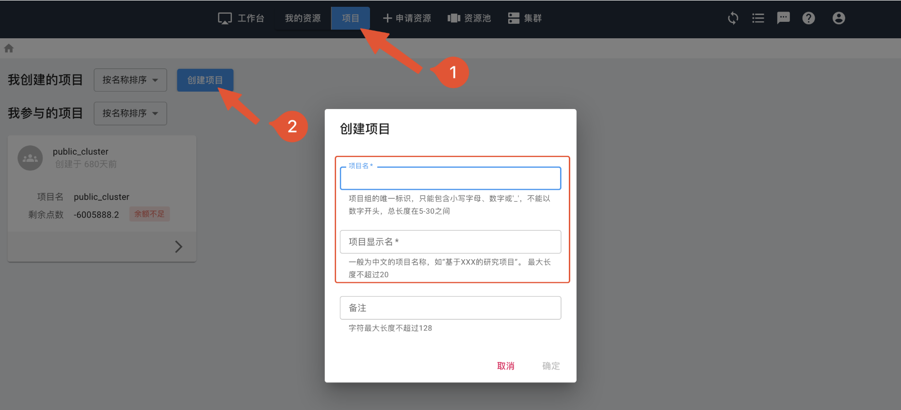
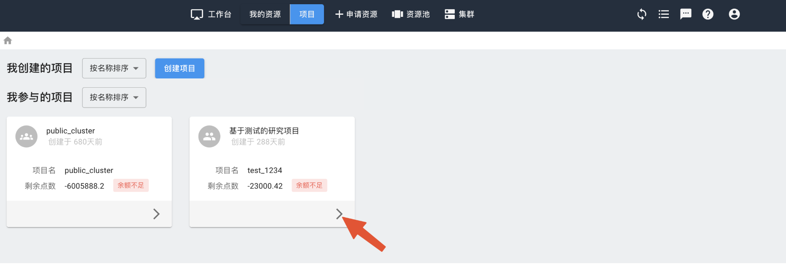
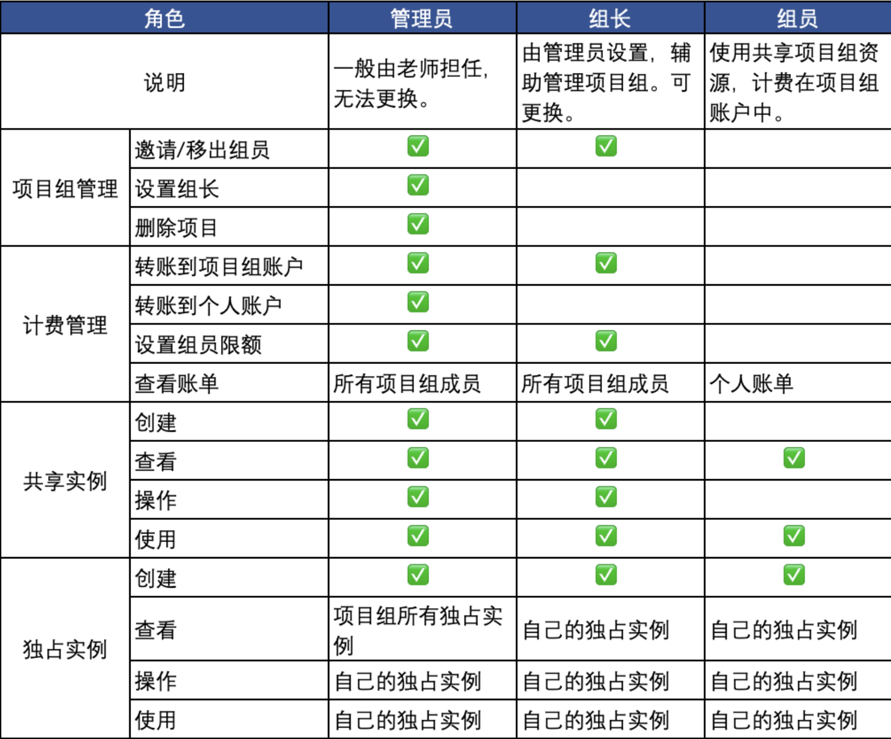
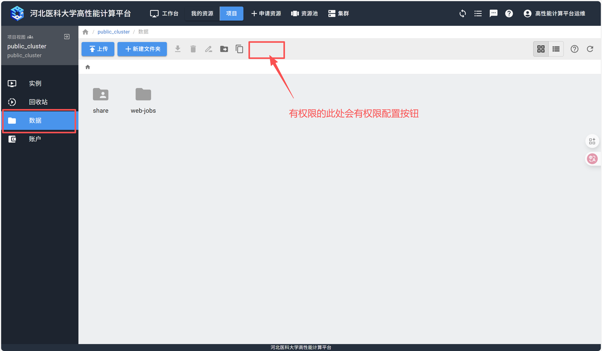
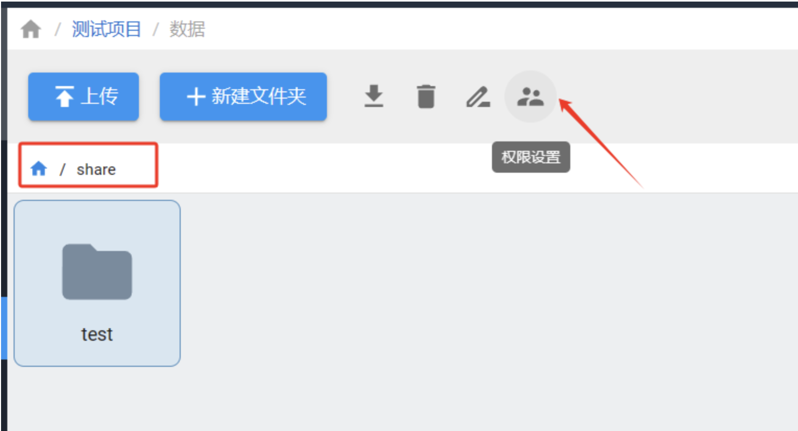
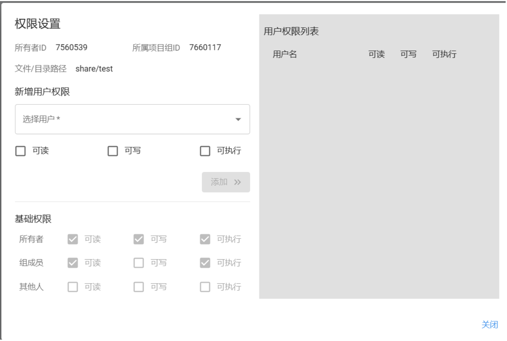
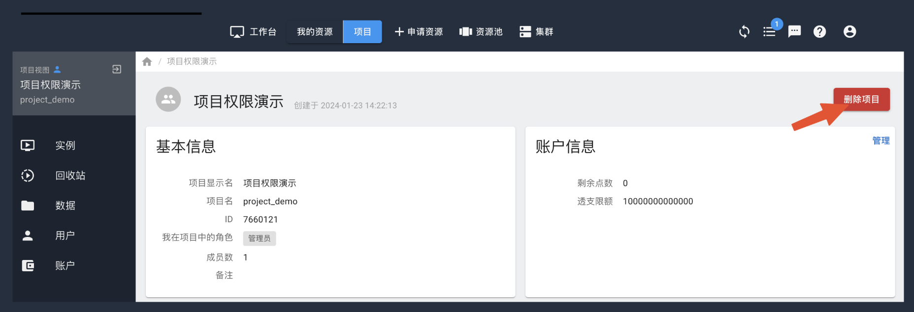

===========
项目共享
===========

项目共享的作用在于项目组内的成员可以使用共享资源，比如实例和数据。

典型的用例如下：

导师或组长在项目组中创建一个共享实例，其他组员都可以使用该实例。
将需要共享的数据放入项目组的 :cmd:`share` 目录下，所有组员都可以访问。
共享项目中可以包含多位用户、多个实例。项目内其他成员可以查看共享到项目内的实例，也可以选择将实例计费计入项目中。

:black:`创建项目`
==================

.. raw:: html

    

点击“项目”后选择“创建项目”，为项目设定项目名和显示名称后确定。

.. warning::

   项目名只能包含字母、数字或, 不能以数字开头，且总长度不超过15。

待项目创建完毕后，点击“项目资源”选择新创建的项目，进入项目管理界面。

当前用户默认为新建项目的管理员。

.. admonition:: 注意

   项目组不能更改管理员，因此建议由老师创建项目，担任管理员，另外在组员中指定一名为组长，协助管理项目组。

:black:`用户类型`
==================

.. raw:: html

    

项目组用户分管理员、组长和组员，具体项目组各成员权限参见下表。

:black:`项目成员管理`
======================

.. raw:: html

    

如果需要和其他用户共享项目实例、账户或数据，需要邀请其他用户进入项目组。

项目管理界面中选择“用户”，在搜索框中输入用户ID并邀请。

.. admonition:: 注意

    邀请前，需要先跟被邀请用户沟通，获取其用户ID或者用户名。

用户接受邀请后，就可与其共享实例和项目数据。

管理员还可以移出项目成员。

:black:`项目数据`
======================

.. raw:: html

    

项目数据目录下的 :cmd:`share` 目录是项目共享目录，项目组所有成员都可以读写。如果是希望共享的数据，需要放在 :cmd:`share` 目录下。

项目数据 :zcred:`根目录` 下，只有当前用户有读写权限，项目组其他成员无法访问。

以下面目录结构为例，:cmd:`a.csv` 全项目组成员都有权限访问，而 :cmd:`b.h` 和 :cmd:`c.txt` 只有当前用户能查看和读写。

.. code-block:: text
    :linenos:

    Project
    ｜--- share
            |--- a.csv
    ｜--- b.h
    ｜--- c.txt

共享项目数据的目录结构和管理请参见文件传输。

:black:`文件权限配置`
======================

.. raw:: html

    

项目管理员可以通过web界面，为项目组share目录下的文件夹配置项目组内成员的权限，包括可读、可写、可执行等。

如图：

:black:`删除项目`
======================

.. raw:: html

    

点击“项目”，进入自己管理的项目，点击页面右上角的删除按钮。

.. warning::

   删除项目前，确保已经停止并删除项目内所有实例，移出除管理员外所有成员，且项目账户点数已为0。