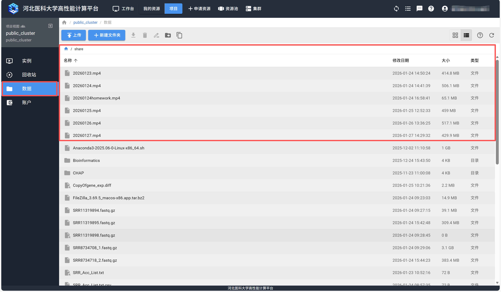

.. 河北医科大学高性能平台用户手册 documentation master file, created by
   sphinx-quickstart on Sun Oct 12 20:52:26 2025.
   You can adapt this file completely to your liking, but it should at least
   contain the root `toctree` directive.

河北医科大学高性能平台用户手册
============================================

.. Add your content using ``reStructuredText`` syntax. See the
  `reStructuredText <https://www.sphinx-doc.org/en/master/usage/restructuredtext/index.html>`_
  documentation for details.

引言
===================

医学科研数据中心自2023年3月开始建设，模块化机房位于医学与健康研究院5楼，占地150平方米。是一个以高性能计算算力与先进人工智能算法，高效安全汇聚基础&临床研究大数据资源，并对海量数据开展多模态多尺度计算分析，揭示数据内在规律、挖掘数据价值的算力-数据-应用一体化的医学科研数据平台。

中心算力资源丰富，目前总CPU双精度计算能力理论值284万亿次以上，总GPU双精度计算能力理论值155.2万亿次以上，总GPU单精度计算能力理论值2284.8万亿次以上。目前医学科研数据中心已试运行数月，已经上线了Amber、AlphaFold2、RobiNA、lucaone、freesurfer等涵盖生物信息、智慧药物、智能影像、医疗大模型等多学科共几十款专业计算分析软件。未来将逐步上线IPA、Schrödinger、MOE等国内外知名专业计算分析软件，支持研究者开展疾病生物标志物或药物治疗靶标发现、蛋白质结构解析和药物设计、人工智能医学影像的研究与转化、生物医学、医疗决策AI大模型等领域研究，为广大科研人员提升研究转化效率作出有力支撑.

**平台功能使用说明**

.. ↓不新开tab
.. 入门级视频教程可见以下链接： `B站视频教程 <https://space.bilibili.com/676435387/lists?sid=2642446>`_

.. ↓ 新开跳转tab

.. raw:: html

   
入门级视频教程可见以下链接：
   <a href="https://space.bilibili.com/676435387/lists?sid=2642446"
      target="_blank"
      rel="noopener noreferrer">
      B站视频教程 ↗
   </a>

.. raw:: html

   
高性能计算平台培训录制文件：
   <a href="https://meeting.tencent.com/crm/lJRyDRWYdd"
      target="_blank"
      rel="noopener noreferrer">
      腾讯会议录制 ↗
   </a>

      也可通过抖音搜索"hpc.cloud"观看相关视频教程。

**科研数据中心算力资源扩容申请及成果登记**

.. 资源扩容申请及成果登记流程： `扩容申请及成果登记 <https://msdc.hebmu.edu.cn/a/2025/05/26/EB5F6B86106D4CDBBADE36BAE7BA0E15.html>`_

.. raw:: html

   
资源扩容申请及成果登记流程：
   <a href="https://msdc.hebmu.edu.cn/a/2025/05/26/EB5F6B86106D4CDBBADE36BAE7BA0E15.html"
      target="_blank"
      rel="noopener noreferrer">
      扩容申请及成果登记 ↗
   </a>

.. **软件安装需求登记**

.. 【高性能计算平台软件安装需求登记】 `软件安装需求登记 <https://docs.qq.com/sheet/DWmVLQnZwcVBaSmJM?no_promotion=1&tab=BB08J2>`__

**用户注册及登录**
  1. :doc:`02-platformmanual/userManual`

**Q&A问题回复**

.. raw:: html

   
联旌官网Q&A：
   <a href="https://hpc.cloud/t/qa"
      target="_blank"
      rel="noopener noreferrer">
      常见问题 ↗
   </a>
   链接跳转网站后搜索框输入问题即可
   

**2026年初最新培训视频**

.. raw:: html

   
最新培训视频：
   <a href="http://10.20.7.1/home/account"
      target="_blank"
      rel="noopener noreferrer">
      高性能平台登录跳转入口 ↗
   </a>
   登录零信任访问高性能平台查看相关视频教程，如下图示例：
   

.. .. figure:: ./_static/img/index/index_1.png
   :align: center
   :alt: 文件检索
   :width: 100%
   :class: zoomable

.. toctree::
   :maxdepth: 2
   :caption: 快速上手
   :hidden:

   申请资源<01-getQuickstart/resourcebuild>
   提交集群作业<01-getQuickstart/submitjobs>
   工作台<01-getQuickstart/dashboard>
   资源池<01-getQuickstart/pool>
   about

.. toctree::
   :maxdepth: 2
   :caption: 平台手册
   :hidden:
   
   用户手册<02-platformmanual/userManual>
   文件传输<02-platformmanual/fileTransfer>
   用户实例<02-platformmanual/userInstance>
   集群登录<02-platformmanual/clusterLogin>
   作业系统<02-platformmanual/jobSystem>
   项目共享<02-platformmanual/projectSharing>
   计费统计<02-platformmanual/billingStatistics>

.. toctree::
   :maxdepth: 2
   :caption: 入门指南
   :hidden:

   
   Linux基本操作<03-startGuide/Linux>
   Conda<03-startGuide/Conda>
   Spack<03-startGuide/Spack>
   Tmux<03-startGuide/Tmux>

.. toctree::
   :maxdepth: 2
   :caption: 应用指南
   :hidden:

  
   Ubuntu<04-application/Ubuntu>

.. toctree::
   :maxdepth: 2
   :caption: 常见问题:
   :hidden:

   moe<05-faq/moe>

.. 
   常见问题解答<05-faq/faq>

..
   索引和目录
   ================

   * :ref:`genindex`
   * :ref:`modindex`
   * :ref:`search`

.. Trigger CI build - do not remove
.. Trigger CI build - do not remove