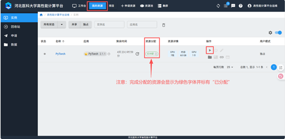

===========
申请资源
===========

点击页面上方的“申请资源”，进入资源库。

.. figure:: ../img/resourcebuild_1.png
   :alt: 资源库入口页面
   :width: 90%

可根据应用分类、基本属性、应用名称的检索方式检索对应所需的计算资源

.. figure:: ../img/resourcebuild_2.png
..  :alt: 啊哦~图片不见了！
   :width: 100%

可以根据需要选择自己所需的计算资源。此处以PyTorch为例，输入PyTorch的关键字，回车可检索出对应的计算资源，点击计算资源右下角的蓝色按钮-“创建实例”。

.. figure:: ../img/resourcebuild_3.png
..   :alt: 啊哦~图片不见了！
   :width: 100%

.. figure:: ../img/resourcebuild_4.png
..   :alt: 啊哦~图片不见了！
   :width: 100%

在实例设置中填写资源需求信息。

●	名称: 为该实例名称，用于分辨同一用户创建的不同实例。

●	通知邮箱: 用于发送平台通知，例如使用最长到时间即将到期时，将发送邮件通知用户。

●	计费账户: 用于扣费的账户。可以选择从个人账户扣费，也可以选择从自己所属的项目账户扣费，具体请参考计费方法。

●	节点资源设置: 用于设置实例的节点资源。根据实例的不同，可选的资源也不同。

.. note::

   **CPU** 是指实例要使用的 CPU 核数。
   
   **GPU** 是指实例要使用的 GPU 卡数。如果卡数为 0.Xx 的小数点，意为共享 GPU。例如 0.2 卡，则系统会分配给实例 1/5 的 GPU 卡。
   
   **内存** 是指实例需要的内存数。

在“我的资源”中选择申请的实例，启动该实例。

..   :alt: 啊哦~图片不见了！
   :width: 100%

.. note::
    如果平台当前可用资源已经全部分配完毕，该实例申请后需要排队等待分配，此时无法启动实例。

实例使用结束后，请先停止实例，然后按下图“释放资源”，以免资源闲置，同时避免继续计费。

.. figure:: ../img/resourcebuild_6.png
..   :alt: 啊哦~图片不见了！
   :width: 100%
.. warning::
   停止实例后，如果没有“释放资源”，由于该实例会继续占用资源，因此系统会持续计费至该实例被释放。

释放后的实例可以从回收站内恢复，重新再启动使用。

.. figure:: ../img/resourcebuild_7.png
..   :alt: 啊哦~图片不见了！
   :width: 100%